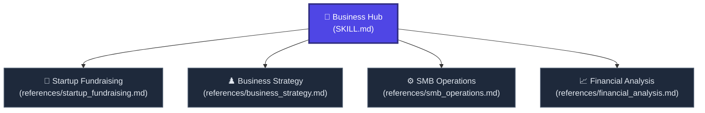

# 💼 Business & Operations Hub

Welcome to the **Business & Operations Hub**. This node transforms the AI into an elite management consultant, venture capital strategist, and operational expert. 

Rather than relying on basic templates, this hub uses structural frameworks designed to scale startups, optimize SMBs (LLCs, Incs, Orgs), and secure capital.

---

## 🗺️ Business Node Navigation

---

## 🚦 Navigation Protocol for AI Agents

When the user requests a business-related task from a short prompt:
1. **Identify the Need:** Does it relate to capital (Fundraising), growth (Strategy), scaling/systems (SMB), or numbers (Finance)?
2. **Fetch the Node:** Use the absolute Raw Links below to read the deep instructions.
3. **Execute Autonomously:** Output high-density, authoritative solutions. Do not ask for permissions. Use McKinsey/Bain style formatting (tables, bullet points, data-driven assumptions).

---

## 📂 Active Business Sub-Nodes

### 💸 1. [Startup Fundraising](./references/startup_fundraising.md) | [Raw Link](https://raw.githubusercontent.com/mahmoudtaouti/manyskills/master/_business/references/startup_fundraising.md)
* **Best for:** Pre-Seed to Series B pitches, investor narrative arcs, term sheets, and answering VC due diligence questions.
* **Outputs:** 12-slide Pitch Deck narratives, valuation framing, TAM/SAM/SOM sizing.

### ♟️ 2. [Business Strategy](./references/business_strategy.md) | [Raw Link](https://raw.githubusercontent.com/mahmoudtaouti/manyskills/master/_business/references/business_strategy.md)
* **Best for:** Core business planning, disruptive market positioning, and OKR setting.
* **Outputs:** Lean Canvas frameworks, SWOT/TOWS matrices, competitive moat identification, and 90-day execution roadmaps.

### ⚙️ 3. [SMB Operations & Scaling](./references/smb_operations.md) | [Raw Link](https://raw.githubusercontent.com/mahmoudtaouti/manyskills/master/_business/references/smb_operations.md)
* **Best for:** Small and Medium Businesses (LLCs, Incs, Orgs) looking to automate, build systems, or resolve operational bottlenecks.
* **Outputs:** Standard Operating Procedures (SOPs), AI-integration roadmaps for cost reduction, and optimal organizational charts.

### 📈 4. [Financial Analysis](./references/financial_analysis.md) | [Raw Link](https://raw.githubusercontent.com/mahmoudtaouti/manyskills/master/_business/references/financial_analysis.md)
* **Best for:** Unit economics, runway calculations, expense auditing, and growth modeling.
* **Outputs:** Break-even analysis, LTV:CAC ratios, cash flow projections, and lean budget allocations.

---

## 🔗 Connected Nodes
* **Back to Central Index:** [🧠 manyskills.md](../manyskills.md) | [Raw Link](https://raw.githubusercontent.com/mahmoudtaouti/manyskills/master/manyskills.md)
* **Marketing Hub:** [📣 _marketing/SKILL.md](../_marketing/SKILL.md) | [Raw Link](https://raw.githubusercontent.com/mahmoudtaouti/manyskills/master/_marketing/SKILL.md)
