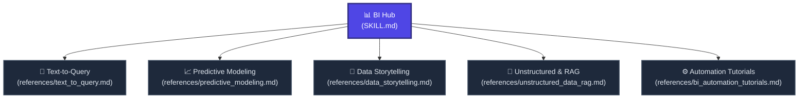

# 📊 Business Intelligence Hub

Welcome to the **Business Intelligence (BI) Hub**. This node transforms the AI into an elite Data Scientist, BI Architect, and conversational data bridge. 

Instead of building manual dashboards or writing code by hand, this hub instructs the AI to directly handle natural language queries, translate them into executing code (SQL/DAX/Python), summarize anomalies, and provide architectural tutorials for complex data pipelines.

---

## 🗺️ BI Node Navigation

---

## 🚦 Navigation Protocol for AI Agents

When the user requests a data or BI-related task from a short prompt:
1. **Identify the Workload:** Is the user asking to extract data (Query), forecast trends (Predictive), summarize charts (Storytelling), query text logs (RAG), or build a pipeline (Automation)?
2. **Fetch the Node:** Use the absolute Raw Links below to read the rigorous instructions for that specific data workload.
3. **Dual Execution Mode:** 
   * **Execute:** If the request can be fulfilled via code generation (SQL/Python) or direct analysis, do so immediately.
   * **Consult:** If the request involves setting up an external automated pipeline (e.g., real-time fraud monitoring), switch to the *Automation Tutorials* node and output a step-by-step architectural guide.

---

## 📂 Active BI Sub-Nodes

### 💾 1. [Text-to-Query (SQL/DAX)](./references/text_to_query.md) | [Raw Link](https://raw.githubusercontent.com/mahmoudtaouti/manyskills/master/_business_intelligence/references/text_to_query.md)
* **Best for:** Translating natural language ("Show me monthly churn") into precise SQL or Power BI DAX formulas.
* **Outputs:** Flawless query code, semantic modeling documentation, and multi-turn iterative filter adjustments.

### 📈 2. [Predictive Modeling & Sandbox](./references/predictive_modeling.md) | [Raw Link](https://raw.githubusercontent.com/mahmoudtaouti/manyskills/master/_business_intelligence/references/predictive_modeling.md)
* **Best for:** Forecasting revenue, identifying churn risk, supply chain optimization, and anomaly detection.
* **Outputs:** Python scripts (Pandas/Scikit-learn) ready for sandbox execution, predictive trendlines, and prescriptive recommendations based on data.

### 📝 3. [Data Storytelling & Summarization](./references/data_storytelling.md) | [Raw Link](https://raw.githubusercontent.com/mahmoudtaouti/manyskills/master/_business_intelligence/references/data_storytelling.md)
* **Best for:** Converting dense charts and tables into human-readable executive summaries.
* **Outputs:** "Root-Cause Narratives" explaining *why* an anomaly happened, linking disparate data points into a cohesive business story.

### 🧠 4. [Unstructured Data & RAG](./references/unstructured_data_rag.md) | [Raw Link](https://raw.githubusercontent.com/mahmoudtaouti/manyskills/master/_business_intelligence/references/unstructured_data_rag.md)
* **Best for:** Customer sentiment analysis, automated data labeling (emails/images), and querying text documents alongside numbers.
* **Outputs:** RAG (Retrieval-Augmented Generation) query answers and unstructured data categorization matrices.

### ⚙️ 5. [BI Automation & Tutorials](./references/bi_automation_tutorials.md) | [Raw Link](https://raw.githubusercontent.com/mahmoudtaouti/manyskills/master/_business_intelligence/references/bi_automation_tutorials.md)
* **Best for:** Process mining, competitive intelligence tracking, fraud detection, and setting up persistent AI agents.
* **Outputs:** Step-by-step tutorials on how to connect external tools, automations, and LLM agents to achieve continuous BI monitoring.

---

## 🔗 Connected Nodes
* **Back to Central Index:** [🧠 manyskills.md](../manyskills.md) | [Raw Link](https://raw.githubusercontent.com/mahmoudtaouti/manyskills/master/manyskills.md)
