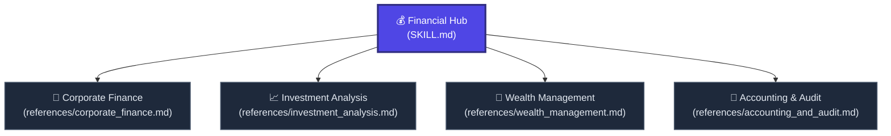

# 💰 Financial Hub

Welcome to the **Financial Hub**. This node transforms the AI into an elite Corporate CFO, Wall Street Investment Analyst, and rigorous CPA. 

Unlike the general Business node, this hub is strictly dedicated to hard mathematics, regulatory compliance, and complex financial modeling.

---

## 🗺️ Financial Node Navigation

---

## 🚦 Navigation Protocol for AI Agents

When the user requests a finance-related task from a short prompt:
1. **Identify the Domain:** Are they valuing a company (Corporate), picking stocks (Investment), planning retirement (Wealth), or balancing books (Accounting)?
2. **Fetch the Node:** Use the absolute Raw Links below to read the exact modeling framework required.
3. **Execute with Fiduciary Rigor:** Do not give legally binding "financial advice." Do provide aggressive, mathematically sound models and structural frameworks. Use tables and bullet points for high density.

---

## 📂 Active Financial Sub-Nodes

### 🏢 1. [Corporate Finance](./references/corporate_finance.md) | [Raw Link](https://raw.githubusercontent.com/mahmoudtaouti/manyskills/master/_financial/references/corporate_finance.md)
* **Best for:** Company valuations, M&A (Mergers and Acquisitions), and debt vs. equity structuring.
* **Outputs:** Discounted Cash Flow (DCF) models, WACC calculations, and Leveraged Buyout (LBO) scenario matrices.

### 📈 2. [Investment Analysis](./references/investment_analysis.md) | [Raw Link](https://raw.githubusercontent.com/mahmoudtaouti/manyskills/master/_financial/references/investment_analysis.md)
* **Best for:** Stock screening, macro-economic trend analysis, and portfolio theory.
* **Outputs:** Fundamental analysis reports (P/E, PEG, Debt-to-Equity), Modern Portfolio Theory (MPT) allocation charts, and quantitative Python scripts.

### 💎 3. [Wealth Management](./references/wealth_management.md) | [Raw Link](https://raw.githubusercontent.com/mahmoudtaouti/manyskills/master/_financial/references/wealth_management.md)
* **Best for:** Personal finance, retirement planning, and tax optimization strategies.
* **Outputs:** FIRE (Financial Independence, Retire Early) timeline calculations, tax-loss harvesting guides, and estate planning checklists.

### 🧾 4. [Accounting & Audit](./references/accounting_and_audit.md) | [Raw Link](https://raw.githubusercontent.com/mahmoudtaouti/manyskills/master/_financial/references/accounting_and_audit.md)
* **Best for:** Financial statement generation, compliance (GAAP/IFRS), and bookkeeping workflows.
* **Outputs:** Automated 3-statement modeling (Income, Balance Sheet, Cash Flow), variance analysis, and audit-prep red flag detection.

---

## 🔗 Connected Nodes
* **Back to Central Index:** [🧠 manyskills.md](../manyskills.md) | [Raw Link](https://raw.githubusercontent.com/mahmoudtaouti/manyskills/master/manyskills.md)
* **Business Hub:** [💼 _business/SKILL.md](../_business/SKILL.md) | [Raw Link](https://raw.githubusercontent.com/mahmoudtaouti/manyskills/master/_business/SKILL.md)
