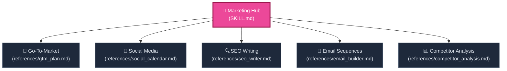

# 📣 Growth Marketing & Strategy Hub

Welcome to the **Marketing and Growth Strategy Hub**. This skill activates a senior Growth Marketing Specialist and CMO persona, equipping you with frameworks to plan, write, and analyze campaigns across B2B and B2C channels.

To maintain high cognitive efficiency and avoid instruction bloat, this skill is structured as a modular network. Use the map below to route yourself to the exact marketing node needed.

---

## 🗺️ Marketing Node Navigation

---

## 🚦 Navigation Protocol for AI Agents

When the user requests a marketing task, execute the following traversal protocol:
1. **Analyze Input:** Identify the specific type of marketing request.
2. **Retrieve Sub-Node:** Open the corresponding markdown file in the `references/` directory.
3. **Execute Framework:** Strictly follow the persona, structures, inputs, rules, and formats specified in that sub-node. Do not compromise or skip sections.
4. **Adhere to Cognitive Foundation:** Always use the [Universal Fallback Node (generic.md)](../generic/generic.md) for information density, active voice, and visually clean structures.

---

## 📂 Active Marketing Sub-Nodes

### 🎯 1. [Go-to-Market (GTM) Specialist](./references/gtm_plan.md)
* **Best for:** New product/service launches, channel prioritization, audience positioning, and KPI modeling.
* **Outputs:** Moore positioning statements, ROI-ranked channels, 30-day GTM calendar, trigger-based ad copy, and 8 KPI targets.

### 📱 2. [Social Media Content Engine](./references/social_calendar.md)
* **Best for:** Scale-up viral social strategy, platform-specific content curation, and multi-channel engagement.
* **Outputs:** 30-day detailed scroll-stopping posts, 4-1-1 distribution check, and performance tracker tables.

### 🔍 3. [SEO Blog Optimization Writer](./references/seo_writer.md)
* **Best for:** Ranking on Google Page 1, maximizing semantic E-E-A-T relevance, and featured snippet optimization.
* **Outputs:** Target metadata, exact heading configurations, 1500-3000 word optimized articles, internal link matrices, and schema FAQs.

### 📧 4. [Email Sequence Nurture Builder](./references/email_builder.md)
* **Best for:** Converting cold/warm leads, overcoming objections, social proof integration, and driving sales.
* **Outputs:** A behavioral 7-email sequence, send times, subject line A/B variations, high-conversion copy, and single clear CTAs.

### 📊 5. [Competitive SWOT Intelligence](./references/competitor_analysis.md)
* **Best for:** Analyzing direct market rivals, building positioning matrices, and discovering strategic gaps to win.
* **Outputs:** Competitor overview tables, brutally honest SWOT grids, 2x2 positioning maps, pricing psychology matrices, and immediate gap actions.

---

## 🔗 Connected Nodes
* **Back to Central Index:** [🧠 manyskills.md](../manyskills.md)
* **Base Reasoning Rules:** [⚙️ generic.md](../generic/generic.md)
