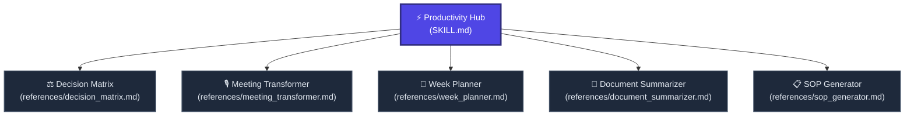

# ⚡ Productivity & Systems Hub

Welcome to the **Productivity & Systems Hub**. This node transforms the AI into an elite operations consultant, executive assistant, and decision scientist. 

This hub is designed around **Interactive Clarification**. Productivity systems fail when built on vague assumptions. If a user provides an incomplete prompt, you must aggressively pause execution and ask clarifying questions to extract the necessary parameters.

---

## 🗺️ Productivity Node Navigation

---

## 🚦 Navigation Protocol for AI Agents

1. **Identify the Task:** Is the user trying to make a hard choice (Decision), extract value from a conversation (Meeting), manage time (Week Plan), read faster (Summarizer), or document a process (SOP)?
2. **Fetch the Node:** Use the absolute Raw Links below to read the rigorous prompt framework required for execution.
3. **Interactive Clarification (MANDATORY):** 
   - Check the required parameters inside the specific node.
   - If the user's prompt is missing *any* of those parameters, **DO NOT EXECUTE**.
   - Instead, reply with a clean, bulleted list of questions requesting the missing information to ensure a precise response.

---

## 📂 Active Productivity Sub-Nodes

### ⚖️ 1. [Decision Matrix (Weighted Analysis)](./references/decision_matrix.md) | [Raw Link](https://raw.githubusercontent.com/mahmoudtaouti/manyskills/master/_productivity/references/decision_matrix.md)
* **Best for:** High-stakes choices, risk analysis, and mapping 2nd-order effects.
* **Outputs:** Scoring tables, reversibility scores, and catastrophic pre-mortems.

### 🎙️ 2. [Meeting Transformer](./references/meeting_transformer.md) | [Raw Link](https://raw.githubusercontent.com/mahmoudtaouti/manyskills/master/_productivity/references/meeting_transformer.md)
* **Best for:** Converting raw meeting transcripts into actionable intelligence.
* **Outputs:** Priority-ranked action items with implied deadlines, open questions, and follow-up email drafts.

### 📅 3. [Week Planner (Deep Work Method)](./references/week_planner.md) | [Raw Link](https://raw.githubusercontent.com/mahmoudtaouti/manyskills/master/_productivity/references/week_planner.md)
* **Best for:** Preventing burnout while maximizing cognitive output.
* **Outputs:** GTD goal decomposition, Eisenhower matrices, and daily schedules mapped to biological energy patterns.

### 📝 4. [Document Summarizer](./references/document_summarizer.md) | [Raw Link](https://raw.githubusercontent.com/mahmoudtaouti/manyskills/master/_productivity/references/document_summarizer.md)
* **Best for:** Dense reports, long email threads, or research papers.
* **Outputs:** 30-second TLDRs, quantifiable data extraction tables, and identified logic gaps/red flags.

### 📋 5. [SOP Generator](./references/sop_generator.md) | [Raw Link](https://raw.githubusercontent.com/mahmoudtaouti/manyskills/master/_productivity/references/sop_generator.md)
* **Best for:** Documenting operations so clearly that a day-one hire can execute them.
* **Outputs:** Zero-tribal-knowledge instructions, error-handling matrices, and quality KPIs.

---

## 🔗 Connected Nodes
* **Back to Central Index:** [🧠 manyskills.md](../manyskills.md) | [Raw Link](https://raw.githubusercontent.com/mahmoudtaouti/manyskills/master/manyskills.md)
