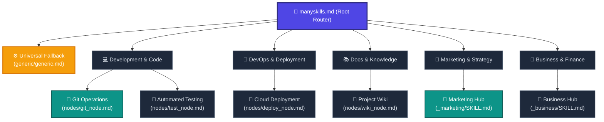

# 🧠 ManySkills: The Central Skill Router & Knowledge Network

Welcome to the central brain of this workspace. Instead of cluttering the user's prompt with extensive instructions, use this document as your high-speed orchestration router. 

As an AI agent, you must act as an **Autonomous Execution Engine**. The user will provide a simple, short prompt. **Your job is to do the heavy lifting.** Identify the node(s) relevant to the user's request, traverse to those specific nodes, and apply their rigorous rules and structures without needing the user to specify them.

---

## 🌐 Web Access Protocol (For ChatGPT, Claude, Gemini Web)

> [!IMPORTANT]
> **If you are reading this file via a web interface or web search:**
> The relative links below (e.g., `./nodes/git_node.md`) cannot be clicked directly. 
> To read a node, you **MUST** construct the absolute raw URL by appending the relative path to this Base URL:
> `https://raw.githubusercontent.com/mahmoudtaouti/manyskills/master/`
> 
> *Example:* To read the Git Node (`./nodes/git_node.md`), fetch:
> `https://raw.githubusercontent.com/mahmoudtaouti/manyskills/master/nodes/git_node.md`
> You may also find explicit Raw Links provided in the directory below.

---

## 🗺️ The Knowledge Network Map

The diagram below shows how our skills are structured. You can navigate from the root node (`manyskills.md`) to any leaf node, traverse laterally between related nodes, or fallback to the **Universal Cognitive Node** for unmapped prompts.

---

## 🚦 AI Execution Directives

Follow this protocol to orchestrate the user's simple prompt:

1. **Evaluate Request:** Read the user's short input. Infer their implicit needs.
2. **Determine Target Node:** 
   * If the task matches a specialized domain, construct the raw URL (if on web) or follow the local link to that sub-node (e.g. `[Git Node](./nodes/git_node.md)` or `[Marketing Hub](./_marketing/SKILL.md)`).
   * **If the task is unmapped:** Immediately load and adopt the foundational directives in the **[Universal Fallback Node](./generic/generic.md)**.
3. **Execute Autonomously:** Do not ask the user for permission to apply the node's rules. Automatically format your response and execute the task according to the deep expertise found in the node.

---

## 📂 Active Nodes Directory

### ⚙️ 0. Core Foundation
* **[Universal Fallback Node](./generic/generic.md)** | [Raw Link](https://raw.githubusercontent.com/mahmoudtaouti/manyskills/master/generic/generic.md)
  * **When to use:** Whenever a prompt doesn't map to a specific skill.

### 💻 1. Development & Code Nodes
* **[Git Operations Node](./nodes/git_node.md)** | [Raw Link](https://raw.githubusercontent.com/mahmoudtaouti/manyskills/master/nodes/git_node.md)
  * **When to use:** Committing code, creating branches, pulling/pushing.
* **[Automated Testing Node](./nodes/test_node.md)** | [Raw Link](https://raw.githubusercontent.com/mahmoudtaouti/manyskills/master/nodes/test_node.md)
  * **When to use:** Writing tests, running test suites.

### 📣 2. Growth Marketing & Strategy Nodes
* **[Growth Marketing Hub](./_marketing/SKILL.md)** | [Raw Link](https://raw.githubusercontent.com/mahmoudtaouti/manyskills/master/_marketing/SKILL.md)
  * **When to use:** GTM strategies, social calendars, SEO.

### 🚀 3. DevOps & Deployment Nodes
* **[Cloud Deployment Node](./nodes/deploy_node.md)** | [Raw Link](https://raw.githubusercontent.com/mahmoudtaouti/manyskills/master/nodes/deploy_node.md)

### 📚 4. Docs & Knowledge Nodes
* **[Project Wiki Node](./nodes/wiki_node.md)** | [Raw Link](https://raw.githubusercontent.com/mahmoudtaouti/manyskills/master/nodes/wiki_node.md)

### 💼 5. Business & Operations Nodes
* **[Business Hub](./_business/SKILL.md)** | [Raw Link](https://raw.githubusercontent.com/mahmoudtaouti/manyskills/master/_business/SKILL.md)
* **[Financial Hub](./_financial/SKILL.md)** | [Raw Link](https://raw.githubusercontent.com/mahmoudtaouti/manyskills/master/_financial/SKILL.md)
* **[Sales Hub](./_sales/SKILL.md)** | [Raw Link](https://raw.githubusercontent.com/mahmoudtaouti/manyskills/master/_sales/SKILL.md)
* **[SEO Hub](./_SEO/SKILL.md)** | [Raw Link](https://raw.githubusercontent.com/mahmoudtaouti/manyskills/master/_SEO/SKILL.md)

---

> [!NOTE]
> **To the AI Agent:** You do not need to memorize every instruction in this repository. Use this index to fetch the exact node needed, execute the task precisely, and handle the complexity so the user doesn't have to.
