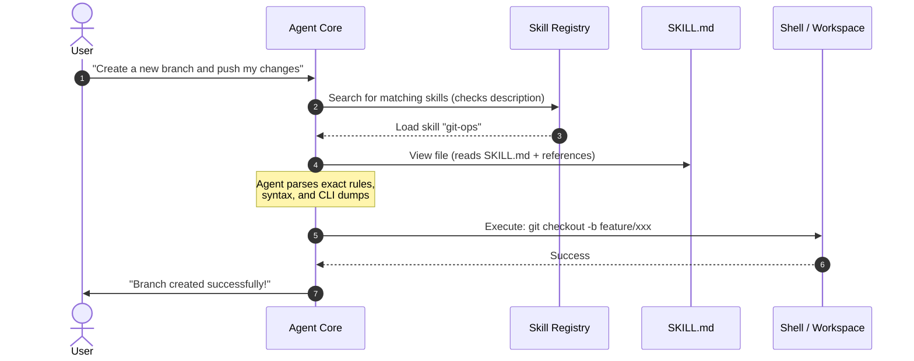

# Empowering AI Agents with Custom Skill Markdown Files

AI agents like Claude, Gemini, and Codex are highly capable, but their performance peaks when they are supplied with structured, targeted, and highly accurate instruction sets. In advanced agentic systems, this is managed via **"Skills"**—specialized directories containing a `SKILL.md` file (and supporting sub-files) that teach the agent how to interact with external tools, APIs, CLIs, and frameworks.

This guide provides a comprehensive tutorial on how to construct these skill files and explains the underlying engineering principles that make them so incredibly effective for modern LLMs.

---

## 🧩 The Cognitive Engineering: Why Skills Empower AI Agents

To design a perfect skill file, you must first understand how an LLM processes it. When an agent reads a skill, several cognitive and attention-based mechanisms are activated:

### 1. Minimizing "Lost in the Middle" & Context Noise
Large language models have massive context windows, but their ability to retrieve information degrades when they are flooded with irrelevant details. 
- **The Skill Solution:** Instead of putting every single tool instruction in the system prompt, skills are **dynamically injected** or **on-demand fetched**.
- **Result:** The agent's attention remains laser-focused on the active task without cognitive overload.

### 2. Eliminating Command-Line & API Hallucinations
LLMs are notoriously prone to guessing CLI flags or API parameters based on outdated training data.
- **The Skill Solution:** Incorporating raw, unedited `--help` outputs or OpenAPI/TypeScript signatures directly inside the skill file gives the model a **deterministic source of truth**.
- **Result:** Zero syntax errors and highly reliable tool execution.

### 3. Recursive Context Discovery (Hyperlinking)
Modern agents understand file paths and can actively follow links using file-reading tools.
- **The Skill Solution:** A core `SKILL.md` file acts as an index, using Markdown links `[Read More](references/detail.md)` to direct the agent to deeper, situational context *only when needed*.
- **Result:** Extremely lightweight main context with rich, drill-down details.

---

## 📂 The Anatomy of a `SKILL.md` File

A standard `SKILL.md` follows a strict, highly parsable structure. Let's break down the necessary sections:

```markdown
---
name: unique-skill-identifier
description: A clear, high-level description outlining when and why the agent should use this skill.
---
# Skill Title (e.g., Android CLI Specialist)

## 1. High-Level Role & Identity
Define *who* the agent becomes when this skill is active, and their main goal.

## 2. Installation / Setup (Actionable Recipes)
Provide absolute, platform-specific installation commands so the agent can self-heal or setup the environment if missing.

## 3. High-Quality Usage Examples
Demonstrate perfect execution patterns, detailing common options, edge cases, and verification strategies.

## 4. Structured References / CLI Help Dumps
Include the literal raw help dumps, command syntaxes, and flag tables. This is the agent's ultimate source of truth.

## 5. Modular Deep Dives (Optional)
Link to sub-documents in a `references/` subdirectory to handle complex sub-workflows.
```

---

## 🛠️ Step-by-Step Tutorial: Constructing a Custom Skill

Let's build a real-world example: **A custom Git workflow and code-review skill** named `git-ops`.

### Step 1: Define the Metadata (YAML Frontmatter)
The frontmatter is parsed by the agent orchestrator to match user queries to relevant skills.

```yaml
---
name: git-ops
description: Orchestrates Git workflows, branching strategies, semantic commit generation, and automated pull-request reviews.
---
```

### Step 2: Establish the Agent's Persona & Objective
Tell the agent how to think and what principles to prioritize when executing the skill.

```markdown
# Git Operations & Pull-Request Specialist

This skill guides the agent in conducting safe, clean Git operations and generating premium quality pull requests that align with professional software engineering standards.

## Core Directives
1. **Never force push** (`-f` or `--force`) unless explicitly approved by the user.
2. **Keep commits atomic**: Bundle one logical change per commit.
3. **Use semantic commit messages** following the Conventional Commits specification.
```

### Step 3: Write Actionable "Self-Healing" Setup Steps
If a tool is not installed, the agent needs to know how to install it.

```markdown
## Environment Verification & Setup

Before executing any commands, check if Git is available. If Git is not installed, direct the user to install it, or run:
- **Windows (Chocolatey):** `choco install git -y`
- **macOS (Homebrew):** `brew install git`
- **Linux (Debian/Ubuntu):** `sudo apt-get install git -y`
```

### Step 4: Detail Core Workflows with Concrete Examples
Show the agent the exact command sequences they must execute.

```markdown
## Standard Feature Branch Workflow

When creating a new feature, execute the following sequence:

1. **Update and clean main branch:**
   ```bash
   git checkout main && git pull origin main && git remote prune origin
   ```
2. **Create a descriptive feature branch:**
   ```bash
   git checkout -b feature/short-descriptive-name
   ```
3. **Stage and commit incrementally:**
   ```bash
   git add -A
   git commit -m "feat(auth): implement JWT token rotation"
   ```
```

### Step 5: Embed Literal Syntax Dumps
Never let the agent guess parameters. Paste the exact help or specification output.

```markdown
## `git commit` Quick Reference
```
Usage: git commit [-a | --interactive | --patch] [-s] [-v] [-u<mode>] [--amend]
                  [--dry-run] [(-c | -C | -F <file> | --fixup=<commit> | --squash=<commit>)
                  [-m <msg>]]
```
```

### Step 6: Create Deep-Dive Hyperlinks for Modular Tasks
Keep the `SKILL.md` readable. Move complex details into a `references/` subdirectory.

```markdown
## Advanced Operations
- For interactive rebasing and conflict resolution, see [Rebase Guide](references/rebase.md).
- For PR review criteria, checklists, and template guidelines, see [PR Review Checklist](references/pr_reviews.md).
```

---

## 🔄 How the Agent Interacts with Skills

The diagram below illustrates the runtime lifecycle of how an agent discovers, loads, reads, and executes a skill.



---

## ⚡ Pro-Tips for Maximizing AI Agent Power

To make your skills truly premium, follow these advanced design tips:

> [!TIP]
> **Use JSON schema blocks for API skills:**
> If your skill teaches an agent how to query a web API, embed example JSON request/response payloads. LLMs are highly proficient at mapping structured data models when provided with exact templates.

> [!IMPORTANT]
> **Always document verification steps:**
> At the end of every workflow section, show the agent *how* to verify success. For example, tell the agent: *"Verify the commit was made by running `git log -n 1` and checking the output."* This closes the execution loop and ensures correctness.

> [!WARNING]
> **Avoid generic, hand-waving descriptions:**
> Do not write *"Run the git commands to push."* Instead, write the exact command sequence:
> `git push -u origin <branch-name>`
> LLMs require highly specific, concrete recipes for consistent, production-grade output.
